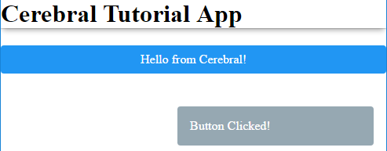

## Update state (Signals)

Defining state and user interfaces is more about describing how something should look, rather than how it should update. Updates are the tricky part, this is where we usually introduce complexity in our application. Cerebral allows you to describe updates the same way you describe state and user interfaces. We call them **Signals** and they will help you handle complexity both in code and in your head, trying to reason about how your application works.
Let us add a signal to our Controller in **src/index.js**:

```js
const controller = Controller({
  devtools: process.env.NODE_ENV === 'production' ? null : Devtools(),
  state: {
    title: 'Hello from Cerebral!',
    appTitle: 'Cerebral Tutorial App'
  },
  signals: {
    buttonClicked: [
      set('state:appTitle', 'Yeah!')
    ]
  }
})

```
We now defined a signal named **buttonClicked**. The signal tells us "what happened to make this signal run". A signal is defined using a chain, which is basically an array of actions. What we want to happen when this signal triggers is to update the **appTitle** in our state with a static value. That is why we **set** it using the Cerebral **set**-operator. Calling set will create an action for us that will copy the value 'Yeah!' to the state. And since our App-Component depends on this **appTitle** 
```
...
connect({
  appTitle: 'appTitle'
},
...
```
it will rerender accordingly.

Have you checked the debugger yet? You will see the debugger list every execution of a signal, with information about what happened. This is also a tool the Cerebral debugger provides to give you insight into your application. Very handy for example when you need to dig into a **complex application** after not touching it for a long time.

So now changing the appTitle is maybe not the right way to output check messages like we did. Let's introduce a very simple "Toast"-Component which will display our **buttonClicked** output.

Because we need to touch a few files and add a new component paste the result from the **parts/05_update_state** folder.

So our app should look like:



now.

What we did:
- **Controller** Added a new object to state (```toast: {message:''}```)
- **Controller** Change the existing Signal to use this new state-path
- **Components** Added Toast-Component

